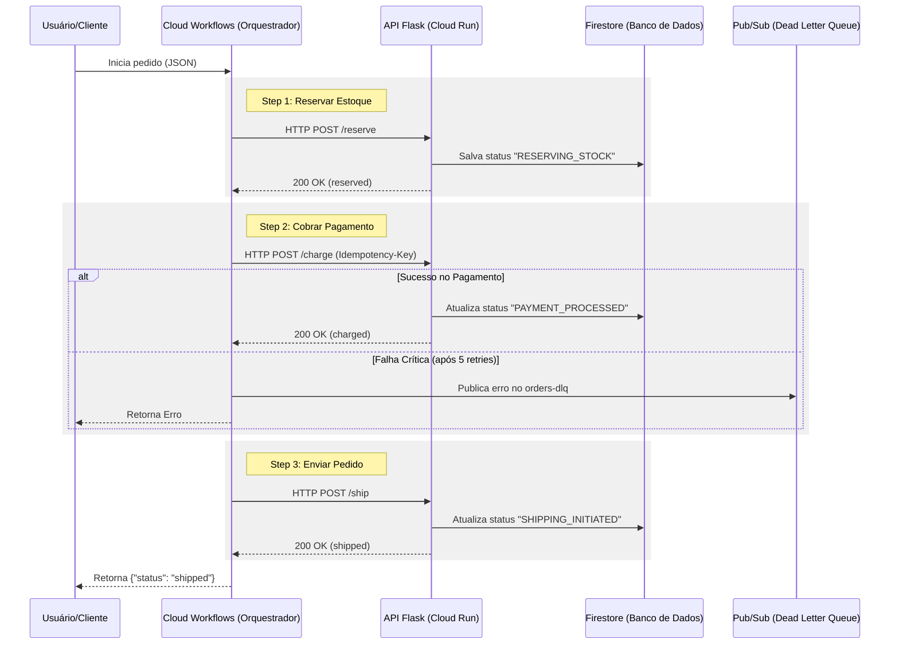

# Arquitetura do Pipeline de Pedidos

Este projeto utiliza um padrão de **Orquestração de Microsserviços** centralizado, não sendo uma arquitetura orientada a eventos (Event-Driven).

## Diagrama de Interações (Orquestração Síncrona)

## Resumo Técnico e Padrões
- **Padrão Arquitetural**: **Orquestração Centralizada**. O Cloud Workflows detém a inteligência do estado e a ordem das operações.
- **Comunicação**: Predominantemente **Síncrona via HTTP**. O orquestrador aguarda o retorno de cada serviço para prosseguir.
- **Serviços**: Flask App no Cloud Run (Stateless).
- **Persistência**: Firestore para tracking de estados e auditoria.
- **Resiliência**: 
  - Idempotência no pagamento via headers.
  - Retry exponencial (5x) gerenciado pelo orquestrador.
  - **Uso de Mensageria**: Pub/Sub utilizado apenas como **Dead Letter Queue (DLQ)** para tratamento assíncrono de erros fatais, e não para o fluxo principal.
